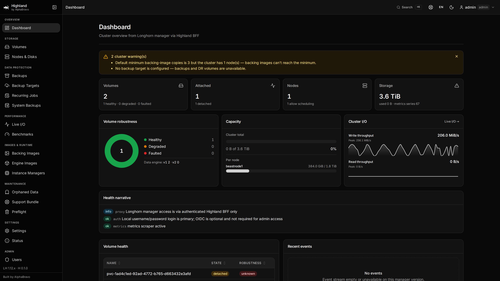

<div align="center">


# Highland

### A secure Kubernetes storage control plane for CSI, Longhorn, Rook/Ceph, OpenEBS, and Piraeus/LINSTOR

Highland is a modern, secure console for Kubernetes storage: provider-neutral CSI inventory,
provider-specific workspaces, durable guarded workflows, and operational insight across Longhorn,
Rook/Ceph, OpenEBS, and Piraeus/LINSTOR — **without replacing the data plane**.

[](https://github.com/alphabravo-oss/highland/actions/workflows/ci.yaml)
[](https://github.com/alphabravo-oss/highland/actions/workflows/release.yaml)
[](LICENSE)
[](https://github.com/orgs/alphabravo-oss/packages?repo_name=highland)
[](https://github.com/alphabravo-oss/highland)

**Built by [AlphaBravo](https://alphabravo.io)**

</div>

---

> **Alpha software.** Highland is under active development. APIs, Helm chart
> values, and UI are subject to change without notice, and it is **not yet
> recommended for production use**. Feedback and issues are very welcome.



## Why Highland

Kubernetes storage spans API objects, CSI drivers, and backend-specific consoles. Highland brings
those facts into one hardened operator experience while keeping Kubernetes authoritative.

- **Enterprise access, built in** — local admin, OIDC/SSO, RBAC (admin vs. viewer), and an audit log.
  The browser **never** receives Kubernetes or storage-provider credentials; access flows through an
  authenticated backend-for-frontend (BFF).
- **Live insight** — real-time volume/node/disk dashboards, per-volume I/O throughput & IOPS charts,
  and on-demand **fio benchmarks** you can run from the UI.
- **Operator-grade console** — enterprise data tables everywhere (sort, search, pagination, CSV export,
  bulk actions), consolidated kebab/action menus, guided wizards, and confirmation modals on every
  destructive action. Light / dark / system themes. English & Spanish.
- **Guided backups** — a step-by-step wizard for S3 / NFS / Azure backup targets and credentials, plus
  full snapshot, backup, restore, DR-standby, and recurring-job management.
- **Universal CSI inventory** — drivers, classes, claims/PVs, workloads, snapshots, attachments,
  capacity, topology, and events, including unknown CSI drivers without custom code.
- **Managed providers** — a full Longhorn operations workspace; Rook/Ceph health, pools, OSDs, RBD,
  CephFS, quorum, mirroring, and safe native Ceph workflows; and OpenEBS engine-aware inventory for
  LocalPV HostPath/LVM/ZFS, Mayastor, and RawFile; plus Piraeus/LINSTOR lifecycle status, capacity,
  placement, protection, diagnostics, and exact CSI correlation.
- **Guarded workflows** — typed plans, role and namespace policy, expiring confirmation, durable
  Kubernetes operations, fresh preflight, audit, and read-only defaults.
- **Kubernetes-native** — Helm chart, stateless signed-cookie sessions (no Redis), Kubernetes Secrets
  for credentials, and ConfigMap-persisted benchmark history. Nothing to babysit.

## What Highland 0.2.0 supports

Highland discovers every CSI driver through Kubernetes and adds deeper, explicitly bounded support
for managed providers. Capabilities are calculated from installed APIs, provider versions, cluster
health, the signed-in role, and the runtime storage policy; unavailable actions remain visibly
disabled instead of failing optimistically.

### Provider coverage

| Provider | Inventory and insight | Highland-managed changes |
|---|---|---|
| **Any detected CSI driver** | Drivers, StorageClasses, PVC/PV, workloads, snapshots, attachments, topology, capacity, events, relationships, capacity forecasting, timelines, and remediation guidance | Portable PVC and snapshot lifecycle workflows when the driver, Kubernetes APIs, class policy, RBAC ceiling, and runtime policy permit them |
| **Longhorn** | Dashboard, volumes, replicas, nodes/disks, live I/O, backups, snapshots, recurring jobs, backup targets, backing/engine images, instance managers, orphans, system backups, support bundles, preflight, and settings | Existing Longhorn-native volume, backup, snapshot, recurring-job, salvage, engine, node/disk, and backup-target actions, plus portable Kubernetes workflows |
| **Rook/Ceph** | Cluster health, MON quorum, OSDs, block pools, RBD images, CephFS, mirroring, Ceph CSI inventory, Prometheus observations, and an authenticated same-origin handoff to the native Ceph Dashboard | Guarded creation of replicated pools and RBD/CephFS StorageClasses; separately gated deletion after fresh dependency and runtime checks; portable PVC/snapshot workflows |
| **OpenEBS** | Components and engine-aware inventory for Dynamic LocalPV HostPath, LocalPV LVM, LocalPV ZFS, Replicated PV Mayastor, and RawFile LocalPV | Portable Kubernetes workflows only; OpenEBS-native mutations remain intentionally read-only in 0.2.0 |
| **Piraeus / LINSTOR** | Piraeus cluster/satellite convergence, components, LINSTOR nodes, pools, resource groups, resources/replicas, snapshots, remotes, schedules, error reports, and exact CSI-handle correlation | Portable Kubernetes workflows only; LINSTOR remains independently lifecycle-managed and native mutations remain read-only |

### Platform capabilities

- Provider selector with distinct navigation and dashboards for each storage backend.
- Cross-provider inventory, relationship graph, event timeline, capacity forecast, risk findings,
  remediation guidance, and provider-attributed `fio` benchmark history.
- Server-Sent Events invalidation with bounded polling fallback, conditional requests, route
  prefetching, query caching, lazy-loaded workspaces, and production bundle budgets.
- Durable `StorageOperation` records with plan/confirm/execute semantics, fresh preflight checks,
  stale-resource protection, recovery, audit records, and terminal operation history.
- Admin-controlled runtime write policy, constrained by Helm-installed RBAC ceilings. Portable
  workflows, Longhorn-native workflows, Rook/Ceph-native workflows, and destructive Ceph gates are
  independent and default to disabled.
- Local break-glass administration, OIDC/SSO, admin/operator/viewer roles, namespace scoping,
  signed sessions, rate limiting, NetworkPolicy, Prometheus metrics, alerts, and Grafana dashboard.
- Responsive light/dark/system themes, English and Spanish localization, keyboard navigation,
  accessible dialogs/tables, CSV export, and mobile layouts.

### Deliberate boundaries

Highland does not call raw CSI sockets, expose Kubernetes or provider credentials to the browser,
relay arbitrary Ceph APIs or commands, or replace a provider's data plane. OpenEBS-native writes,
Ceph OSD/MON/MGR repair and topology changes, backend upgrades, erasure-code management, and
cross-provider data migration are not part of 0.2.0. See the
[capability matrix](docs/storage-capability-matrix.md) for the exact fail-closed contract and the
[compatibility matrix](docs/compatibility.yaml) for tested versions.

---

## Quick start

### Install the provider-neutral control plane

> **Prerequisites:** a Kubernetes cluster, Helm, and kubectl. Highland automatically discovers CSI
> drivers and Kubernetes storage resources; Longhorn, Rook/Ceph, OpenEBS, and Piraeus/LINSTOR are optional deeper
> integrations, not installation prerequisites.

Install straight from GitHub Container Registry — no cloning, no image builds:

```bash
helm install highland oci://ghcr.io/alphabravo-oss/charts/highland \
  --version 0.2.0 \
  --namespace highland-system --create-namespace \
  --set auth.local.createSecret=true \
  --set auth.local.password='change-me'
```

Then open the UI:

```bash
kubectl -n highland-system port-forward svc/highland-web 8080:80
# → http://127.0.0.1:8080     log in with  admin / change-me
```

This base installation provides universal CSI inventory for every detected driver. Enable any
combination of deeper provider workspaces with a Helm upgrade:

| Existing provider | Values to add | What Highland adds |
|---|---|---|
| **Longhorn** | `--set providers.longhorn.enabled=true --set longhorn.namespace=longhorn-system` | Full Longhorn operations, backups, snapshots, nodes/disks, settings, and native workflows |
| **Rook/Ceph** | `--set providers.rookCeph.enabled=true --set providers.rookCeph.namespace=rook-ceph` | Ceph health, quorum, OSD, pool, RBD, CephFS, mirroring, and guarded native workflows |
| **OpenEBS** | `--set providers.openebs.enabled=true --set providers.openebs.namespace=openebs` | Engine-aware inventory for LocalPV HostPath/LVM/ZFS, Mayastor, and RawFile |
| **Piraeus / LINSTOR** | `--set providers.linstor.enabled=true --set providers.linstor.namespace=piraeus-datastore` | Piraeus lifecycle status plus LINSTOR runtime, capacity, placement, protection, diagnostics, and CSI correlation |
| **Any other CSI driver** | No provider setting required | Provider-neutral drivers, classes, claims, volumes, workloads, snapshots, topology, capacity, events, and operations |

For example, a cluster running all four managed providers can enable them together:

```bash
helm upgrade highland oci://ghcr.io/alphabravo-oss/charts/highland \
  --version 0.2.0 \
  --namespace highland-system \
  --reuse-values \
  --set providers.longhorn.enabled=true \
  --set longhorn.namespace=longhorn-system \
  --set providers.rookCeph.enabled=true \
  --set providers.rookCeph.namespace=rook-ceph \
  --set providers.openebs.enabled=true \
  --set providers.openebs.namespace=openebs \
  --set providers.linstor.enabled=true \
  --set providers.linstor.namespace=piraeus-datastore
```

Provider switches add discovery and the corresponding UI workspace; they do not install those
storage systems or enable writes. Configure the optional Ceph Dashboard gateway, write-policy RBAC
ceilings, ingress, and production authentication using **[docs/INSTALL.md](docs/INSTALL.md)**.

### All-in-one Highland + Longhorn (opt-in alpha)

Embedded mode installs the pinned Longhorn backend in the same Helm release and scales the stock
Longhorn UI to zero. Use it only on a cluster that does **not** already have Longhorn, prepare every
storage node using the [Longhorn prerequisites](docs/INSTALL.md#embedded-longhorn-node-prerequisites),
and install the release in `longhorn-system`:

```bash
helm install highland oci://ghcr.io/alphabravo-oss/charts/highland \
  --version 0.2.0 \
  --namespace longhorn-system --create-namespace \
  --set embeddedLonghorn.enabled=true \
  --set auth.local.createSecret=true \
  --set auth.local.password='change-me' \
  --wait --timeout 10m

kubectl -n longhorn-system port-forward svc/highland-web 8080:80
# → http://127.0.0.1:8080
```

> **Data-loss warning:** an embedded release owns the storage backend as well as Highland. Do not run
> `helm uninstall` until Longhorn-backed workloads and volumes are safely removed or backed up, and
> follow the [embedded uninstall runbook](docs/INSTALL.md#11-uninstall).

That's it. To expose it beyond your laptop, enable the Ingress (`--set ingress.enabled=true`) or a
NodePort/LoadBalancer service — see **[docs/INSTALL.md](docs/INSTALL.md)** (and **[docs/K3S.md](docs/K3S.md)**
for k3s notes).

### Container images

Prebuilt images are published to GHCR on every release:

| Image | Pull |
|-------|------|
| API (BFF) | `ghcr.io/alphabravo-oss/highland-api` |
| Web (console) | `ghcr.io/alphabravo-oss/highland-web` |

Tags: `latest`, `edge` (main), `<version>` (e.g. `0.2.0`), and `sha-<commit>`.

### Try it locally (Docker Compose)

Spin up the whole topology — including a mock Longhorn manager — on your machine:

```bash
docker compose -f deploy/docker-compose.yaml up --build
# → http://127.0.0.1:8088     admin / highland
```

---

## Architecture

```text
Browser ──▶ highland-web ──▶ highland-api ──▶ Kubernetes APIs (CSI inventory + operations)
            static console    auth/RBAC/audit ├──▶ Longhorn manager (managed adapter + legacy API)
                              signed sessions ├──▶ Rook CRDs · Ceph Dashboard GET · Prometheus
                                              ├──▶ OpenEBS CRDs and controller status
                                              └──▶ Piraeus CRDs · LINSTOR REST (fixed GET endpoints)
```

The browser never receives Kubernetes/provider credentials or direct provider access. The **BFF**
terminates auth, enforces action and namespace policy, serves informer-backed inventory, and audits
mutations. Highland does not call CSI sockets or expose a raw Ceph proxy.

```text
highland/
├── apps/
│   ├── api/    # Go BFF: auth, CSI inventory, provider adapters, durable operations, legacy Longhorn
│   └── web/    # React 19 + Vite + TypeScript + Tailwind 4 console
├── chart/      # Helm chart (api + web + RBAC + NetworkPolicy)
└── docs/       # install, k3s, UX, parity matrix
```

---

## Configuration highlights

| Area | How |
|------|-----|
| **Local admin** | `auth.local.createSecret=true` + `auth.local.password`, or point at an existing Secret with `auth.local.existingSecret`. |
| **SSO / OIDC** | Configure `auth.oidc.*`; users map to admin/viewer roles. |
| **Backups** | Use the in-app **backup setup wizard** (S3 / NFS / Azure) — it provisions the credential Secret and backup target for you. |
| **Sessions** | Stateless HMAC-signed cookies — no Redis, no external session store. |
| **Universal storage** | `storage.enabled=true`; choose cluster or namespace-allowlist scope. |
| **Storage writes** | `storage.writes.enabled=false` by default; approved workflows use durable `StorageOperation` records. |
| **Longhorn provider** | `longhorn.enabled=true` for the legacy bolt-on switch, or `providers.longhorn.enabled`; namespace defaults to `longhorn-system`. |
| **Rook/Ceph provider** | Opt in with `providers.rookCeph.enabled=true` and a dedicated read-only Dashboard Secret. |
| **OpenEBS provider** | Opt in with `providers.openebs.enabled=true`; Highland adds bounded read-only engine discovery and no OpenEBS write RBAC. |
| **Piraeus / LINSTOR provider** | Opt in with `providers.linstor.enabled=true`; an optional fixed controller URL, token Secret, and CA Secret add bounded runtime detail. Highland never installs or lifecycle-manages LINSTOR. |
| **Runtime policy** | `adminPolicyControl.enabled=true` exposes the admin policy UI; it can only enable capabilities installed in `adminPolicyControl.ceiling.*`. |
| **Ceph Dashboard gateway** | Configure `providers.rookCeph.dashboard.url`; Highland serves the native Dashboard through its authenticated `/ceph-dashboard/` path, so `publicUrl` is not required. |
| **Embedded Longhorn** | `embeddedLonghorn.enabled=true` installs pinned Longhorn 1.12.0 in the release namespace; default is `false`. |
| **Embedded tuning** | Pass Longhorn chart values under `embeddedLonghorn.*`; the stock UI remains off by default. |

Full references: **[install](docs/INSTALL.md)**, **[storage control plane](docs/storage-control-plane.md)**,
**[capability matrix](docs/storage-capability-matrix.md)**, **[compatibility matrix](docs/compatibility.yaml)**,
**[RBAC](docs/security/storage-rbac.md)**, **[troubleshooting](docs/troubleshooting-storage.md)**, and
**[OpenAPI](docs/openapi/storage-v1.yaml)**.

---

## Development

```bash
# API (Go)                      # Web (React + Vite + TS)
cd apps/api && go test ./...    cd apps/web && npm ci && npm run dev
```

CI runs Go build/test, web typecheck/unit/build/Storybook, a Playwright smoke + a11y suite, Helm lint
and both chart deployment-mode renders, plus a parity gate on every push. Images and the Helm chart publish to GHCR on tagged releases. See
`.github/workflows/`.

---

## License

[Apache 2.0](LICENSE) © [AlphaBravo](https://alphabravo.io)

<div align="center"><sub>Built with care by <a href="https://alphabravo.io">AlphaBravo</a> — enterprise Kubernetes, security, and platform engineering.</sub></div>
